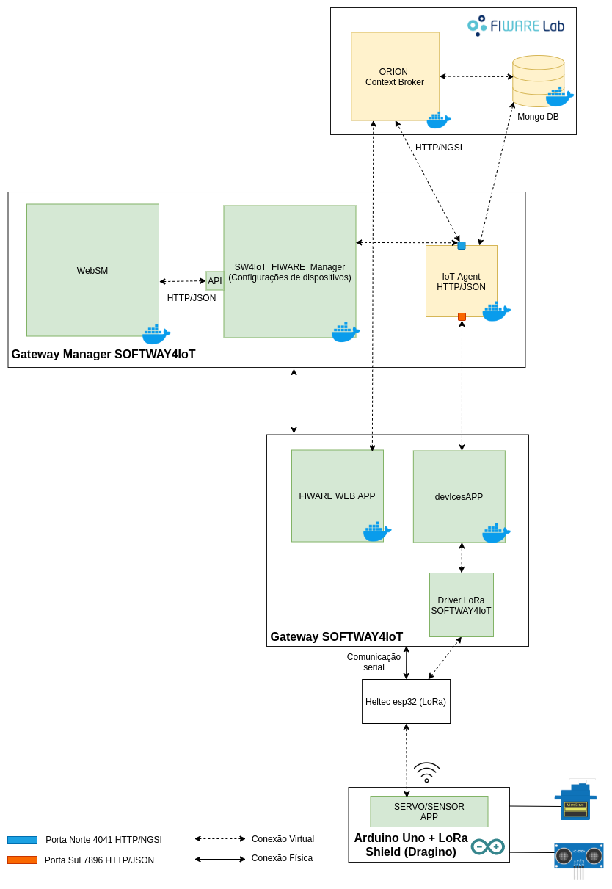

# Aplicações de exemplo - Arduino Uno + Shield Lora (Dragino) 
Nesse repositório há 5 aplicações de exemplo, as quais foram desenvolvidas para teste, sendo:
 * Uma aplicação que ativa um motor servo ao receber um pacote LoRa gerado pela interface LoRa do gateway (Heltec Esp32).
 * Uma aplicação que envia através de um pacote LoRa as medições coletadas por um sensor ultrasônico, sendo esse pacote interceptado pela interface LoRa do gateway (Heltec Esp32). 
 * Uma aplicação que opera nos dois sentidos, mesclando as duas aplicações anteriores (Utilizada no teste final).
 * Uma aplicação que atua como LoRa Sender (Utilizado como base para a aplicação do sensor ultrasônico).
 * Um aplicação que atua como LoRa Receiver (Utilizada com base para a aplicação do motor servo).

# Disposição dos componentes - Teste LoRa

  

